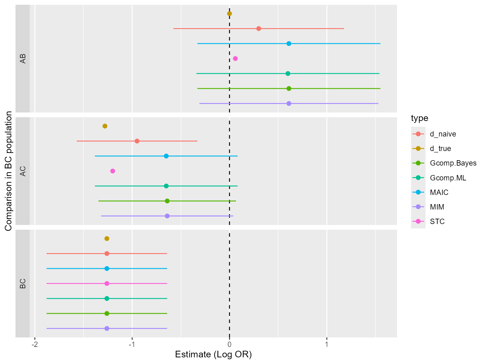
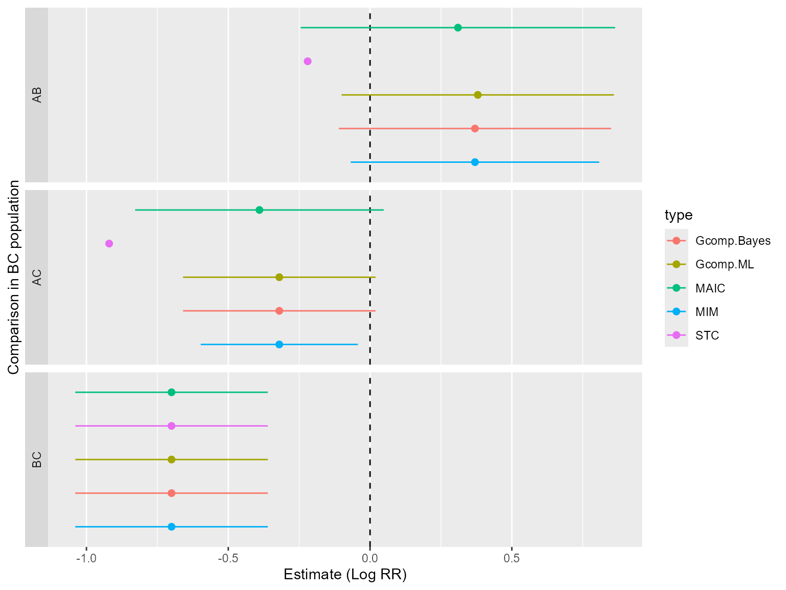

# Binary data example

## Introduction

This vignette will demonstrate the use of the
[outstandR](https://StatisticsHealthEconomics.github.io/outstandR)
package to fit the range of types of models to simulated binary data.
Related vignettes will provide equivalent analyses for continuous and
count data.

## Analysis

First, let us load necessary packages.

``` r

# install.packages("outstandR",
#  repos = c("https://statisticshealtheconomics.r-universe.dev", "https://cloud.r-project.org"))
#
# install.packages("simcovariates",
#  repos = c("https://n8thangreen.r-universe.dev", "https://cloud.r-project.org"))

library(boot)      # non-parametric bootstrap in MAIC and ML G-computation
library(copula)    # simulating BC covariates from Gaussian copula
library(rstanarm)  # fit outcome regression, draw outcomes in Bayesian G-computation
library(tidyr)
library(dplyr)
library(MASS)
library(outstandR)
library(simcovariates)
```

### Data

We consider binary outcomes using the log-odds ratio as the measure of
effect. For example, the binary outcome may be response to treatment or
the occurrence of an adverse event. For trials *AC* and *BC*, outcome
$`y_i`$ for subject $`i`$ is simulated from a Bernoulli distribution
with probabilities of success generated from logistic regression.

For the *BC* trial, the individual-level covariates and outcomes are
aggregated to obtain summaries. The continuous covariates are summarized
as means and standard deviations, which would be available to the
analyst in the published study in a table of baseline characteristics in
the RCT publication. The binary outcomes are summarized in an overall
event table. Typically, the published study only provides aggregate
information to the analyst.

The simulation input parameters are given below.

| Parameter | Description | Value |
|----|----|----|
| `N` | Sample size | 200 |
| `allocation` | Active treatment vs. placebo allocation ratio (2:1) | 2/3 |
| `b_trt` | Conditional effect of active treatment vs. comparator (log(0.17)) | -1.77196 |
| `b_X` | Conditional effect of each prognostic variable (-log(0.5)) | 0.69315 |
| `b_EM` | Conditional interaction effect of each effect modifier (-log(0.67)) | 0.40048 |
| `meanX_AC[1]` | Mean of prognostic factor in AC trial | 0.45 |
| `meanX_AC[2]` | Mean of prognostic factor in AC trial | 0.45 |
| `meanX_EM_AC[1]` | Mean of effect modifier in AC trial | 0.45 |
| `meanX_EM_AC[2]` | Mean of effect modifier in AC trial | 0.45 |
| `meanX_BC[1]` | Mean of prognostic factor in BC trial | 0.6 |
| `meanX_BC[2]` | Mean of prognostic factor in BC trial | 0.6 |
| `meanX_EM_BC[1]` | Mean of effect modifier in BC trial | 0.6 |
| `meanX_EM_BC[2]` | Mean of effect modifier in BC trial | 0.6 |
| `sdX` | Standard deviation of prognostic factors (AC and BC) | 0.4 |
| `sdX_EM` | Standard deviation of effect modifiers | 0.4 |
| `corX` | Covariate correlation coefficient | 0.2 |
| `b_0` | Baseline intercept | -0.6 |

We shall use the
[`gen_data()`](https://rdrr.io/pkg/simcovariates/man/gen_data.html)
function available with the
[simcovariates](https://github.com/n8thangreen/simcovariates) package on
GitHub.

``` r

N <- 200
allocation <- 2/3      # active treatment vs. placebo allocation ratio (2:1)
b_trt <- log(0.17)     # conditional effect of active treatment vs. common comparator
b_X <- -log(0.5)       # conditional effect of each prognostic variable
b_EM <- -log(0.67)     # conditional interaction effect of each effect modifier
meanX_AC <- c(0.45, 0.45)       # mean of normally-distributed covariate in AC trial
meanX_BC <- c(0.6, 0.6)         # mean of each normally-distributed covariate in BC
meanX_EM_AC <- c(0.45, 0.45)    # mean of normally-distributed EM covariate in AC trial
meanX_EM_BC <- c(0.6, 0.6)      # mean of each normally-distributed EM covariate in BC
sdX <- c(0.4, 0.4)     # standard deviation of each covariate (same for AC and BC)
sdX_EM <- c(0.4, 0.4)  # standard deviation of each EM covariate
corX <- 0.2            # covariate correlation coefficient  
b_0 <- -0.6            # baseline intercept coefficient  ##TODO: fixed value

covariate_defns_ipd <- list(
  PF_cont_1 = list(type = continuous(mean = meanX_AC[1], sd = sdX[1]),
                    role = "prognostic"),
  PF_cont_2 = list(type = continuous(mean = meanX_AC[2], sd = sdX[2]),
                    role = "prognostic"),
  EM_cont_1 = list(type = continuous(mean = meanX_EM_AC[1], sd = sdX_EM[1]),
                    role = "effect_modifier"),
  EM_cont_2 = list(type = continuous(mean = meanX_EM_AC[2], sd = sdX_EM[2]),
                    role = "effect_modifier")
)

b_prognostic <- c(PF_cont_1 = b_X, PF_cont_2 = b_X)

b_effect_modifier <- c(EM_cont_1 = b_EM, EM_cont_2 = b_EM)

num_normal_covs <- length(covariate_defns_ipd)
cor_matrix <- matrix(corX, num_normal_covs, num_normal_covs)
diag(cor_matrix) <- 1

rownames(cor_matrix) <- c("PF_cont_1", "PF_cont_2", "EM_cont_1", "EM_cont_2")
colnames(cor_matrix) <- c("PF_cont_1", "PF_cont_2", "EM_cont_1", "EM_cont_2")

ipd_trial <- simcovariates::gen_data(
  N = N,
  b_0 = b_0,
  b_trt = b_trt,
  covariate_defns = covariate_defns_ipd,
  b_prognostic = b_prognostic,
  b_effect_modifier = b_effect_modifier,
  cor_matrix = cor_matrix,
  trt_assignment = list(prob_trt1 = allocation),
  family = binomial("logit"))
```

The treatment column in the return data is binary and takes values 0
and 1. We will include some extra information about treatment names. To
do this we will define the lable of the two level factor as `A` for 1
and `C` for 0 as follows.

``` r

ipd_trial$trt <- factor(ipd_trial$trt, labels = c("C", "A"))
```

Similarly, to obtain the aggregate data we will simulate IPD but with
the additional summarise step. We set different mean values `meanX_BC`
and `meanX_EM_BC` but otherwise use the same parameter values as for the
$`AC`$ trial.

``` r

covariate_defns_ald <- list(
  PF_cont_1 = list(type = continuous(mean = meanX_BC[1], sd = sdX[1]),
                    role = "prognostic"),
  PF_cont_2 = list(type = continuous(mean = meanX_BC[2], sd = sdX[2]),
                    role = "prognostic"),
  EM_cont_1 = list(type = continuous(mean = meanX_EM_BC[1], sd = sdX_EM[1]),
                    role = "effect_modifier"),
  EM_cont_2 = list(type = continuous(mean = meanX_EM_BC[2], sd = sdX_EM[2]),
                    role = "effect_modifier")
)

BC.IPD <- simcovariates::gen_data(
  N = N,
  b_0 = b_0,
  b_trt = b_trt,
  covariate_defns = covariate_defns_ald,
  b_prognostic = b_prognostic,
  b_effect_modifier = b_effect_modifier,
  cor_matrix = cor_matrix,
  trt_assignment = list(prob_trt1 = allocation),
  family = binomial("logit"))

BC.IPD$trt <- factor(BC.IPD$trt, labels = c("C", "B"))

# covariate summary statistics
# assume same between treatments
cov.X <- 
  BC.IPD %>%
  as.data.frame() |> 
  dplyr::select(matches("^(PF|EM)"), trt) |> 
  tidyr::pivot_longer(
    cols = starts_with("PF") | starts_with("EM"),
    names_to = "variable",
    values_to = "value") |>
  group_by(variable) %>%
  summarise(
    mean = mean(value),
    sd = sd(value)
  ) %>%
  tidyr::pivot_longer(
    cols = c("mean", "sd"),
    names_to = "statistic",
    values_to = "value") %>%
  ungroup() |> 
  mutate(trt = NA)

# outcome
summary.y <- 
  BC.IPD |> 
  as.data.frame() |> 
  dplyr::select(y, trt) %>%
  tidyr::pivot_longer(cols = "y",
               names_to = "variable",
               values_to = "value") %>%
  group_by(variable, trt) %>%
  summarise(
    mean = mean(value),
    sd = sd(value),
    sum = sum(value)
  ) %>%
  tidyr::pivot_longer(
    cols = c("mean", "sd", "sum"),
    names_to = "statistic",
    values_to = "value") %>%
  ungroup()
#> `summarise()` has grouped output by 'variable'. You can override using the
#> `.groups` argument.

# sample sizes
summary.N <- 
  BC.IPD |> 
  group_by(trt) |> 
  count(name = "N") |> 
  tidyr::pivot_longer(
    cols = "N",
    names_to = "statistic",
    values_to = "value") |> 
  mutate(variable = NA_character_) |> 
  dplyr::select(variable, statistic, value, trt)
  
ald_trial <- rbind.data.frame(cov.X, summary.y, summary.N)
```

This general format of the data sets are in a ‘long’ style consisting of
the following.

#### `ipd_trial`: Individual patient data

- `PF_*`: Patient measurements prognostic factors
- `EM_*`: Patient measurements effect modifiers
- `trt`: Treatment label (factor)
- `y`: Indicator of whether event was observed (two level factor)

#### `ald_trial`: Aggregate-level data

- `variable`: Covariate name. In the case of treatment arm sample size
  this is `NA`
- `statistic`: Summary statistic name from mean, standard deviation or
  sum
- `value`: Numerical value of summary statistic
- `trt`: Treatment label. Because we assume a common covariate
  distribution between treatment arms this is `NA`

Our data look like the following.

``` r

head(ipd_trial)
#>   id   PF_cont_1   PF_cont_2  EM_cont_1   EM_cont_2 trt y     true_eta
#> 1  1  0.75056436  0.95597583  0.3158969  1.19430733   C 0  0.582883524
#> 2  2  0.83246940  0.11789773  0.5094678  0.08180243   A 1 -1.476422106
#> 3  3  1.13401333  1.15036919  1.2342379  0.74771694   A 0  0.005184912
#> 4  4  0.78518298  0.83080451 -0.1625820  0.35223227   C 1  0.520117172
#> 5  5 -0.38547667  0.87070020  0.7213797 -0.03557032   A 1 -1.760974264
#> 6  6 -0.04851591 -0.03013213  0.6580067  0.05853054   A 0 -2.139514435
```

There are 4 correlated continuous covariates generated per subject,
simulated from a multivariate normal distribution. Treatment `trt` takes
either new treatment *A* or standard of care / status quo *C*. The ITC
is ‘anchored’ via *C*, the common treatment.

``` r

ald_trial
#> # A tibble: 16 × 4
#>    variable  statistic   value trt  
#>    <chr>     <chr>       <dbl> <chr>
#>  1 EM_cont_1 mean        0.616 NA   
#>  2 EM_cont_1 sd          0.408 NA   
#>  3 EM_cont_2 mean        0.635 NA   
#>  4 EM_cont_2 sd          0.354 NA   
#>  5 PF_cont_1 mean        0.666 NA   
#>  6 PF_cont_1 sd          0.398 NA   
#>  7 PF_cont_2 mean        0.663 NA   
#>  8 PF_cont_2 sd          0.404 NA   
#>  9 y         mean        0.597 C    
#> 10 y         sd          0.494 C    
#> 11 y         sum        43     C    
#> 12 y         mean        0.297 B    
#> 13 y         sd          0.459 B    
#> 14 y         sum        38     B    
#> 15 NA        N          72     C    
#> 16 NA        N         128     B
```

In this case, we have 4 covariate mean and standard deviation values;
and the event total, average and sample size for each treatment *B* and
*C*.

#### Regression model

The true logistic outcome model which we use to simulate the data is

``` math
\text{logit}(p_{t}) = \beta_0 + \beta_X (X_3 + X_4) + [\beta_{t} + \beta_{EM} (X_1 + X_2)] \; \text{I}(t \neq C)
```

$`\text{I}()`$ is an indicator function taking value 1 if true and 0
otherwise. That is, for treatment $`C`$ the right hand side becomes
$`\beta_0 + \beta_X (X_3 + X_4)`$ and for comparator treatments $`A`$ or
$`B`$ there is an additional $`\beta_t + \beta_{EM} (X_1 + X_2)`$
component consisting of the effect modifier terms and the coefficient
for the treatment parameter, $`\beta_t`$ (or `b_trt` in the R code),
i.e. the log odds-ratio (LOR) for the logit model. Finally, $`p_{t}`$ is
the probability of experiencing the event of interest for treatment
$`t`$.

### Output statistics

We will obtain the *marginal treatment effect* and *marginal variance*.
The definition by which of these are calculated depends on the type of
data and outcome scale. For our current example of binary data and
log-odds ratio the marginal treatment effect is

``` math
\log\left( \frac{n_B/(N_B-n_B)}{n_C/(N_B-n_{B})} \right) = \log(n_B n_{\bar{C}}) - \log(n_C n_{\bar{B}})
```

and marginal variance is

``` math
\frac{1}{n_C} + \frac{1}{n_{\bar{C}}} + \frac{1}{n_B} + \frac{1}{n_{\bar{B}}}
```

where $`n_B, n_C`$ are the number of events in each arm and $`\bar{C}`$
is the compliment of $`C`$, so e.g. $`n_{\bar{C}} = N_C - n_c`$. Other
outcome scales will be discussed below.

## Model fitting in R

The [outstandR](https://StatisticsHealthEconomics.github.io/outstandR)
package has been written to be easy to use and essentially consists of a
single function,
[`outstandR()`](https://StatisticsHealthEconomics.github.io/outstandR/reference/outstandR.md).
This can be used to run all of the different types of model, which when
combined with their specific parameters we will call *strategies*. The
first two arguments of
[`outstandR()`](https://StatisticsHealthEconomics.github.io/outstandR/reference/outstandR.md)
are the individual patient and aggregate-level data, respectively.

A `strategy` argument of `outstandR` takes functions called
`strategy_*()`, where the wildcard `*` is replaced by the name of the
particular method required,
e.g. [`strategy_maic()`](https://StatisticsHealthEconomics.github.io/outstandR/reference/strategy.md)
for MAIC. Each specific example is provided below.

### Model formula

We will take advantage of the in-built R formula object to define the
models. This will allow us to easily pull out components of the object
and consistently use it. Defining $`EM\_cont\_1, EM\_cont\_2`$ as effect
modifiers, $`PF\_cont\_1, PF\_cont\_2`$ as prognostic variables and
$`Z`$ the treatment indicator then the formula used in this model is

``` math
y = PF\_cont\_1 + PF\_cont\_2 + Z + Z \times EM\_cont\_1 + Z \times EM\_cont\_2
```

Notice that this does not include the link function of interest so
appears as a linear regression. This corresponds to the following `R`
`formula` object we will pass as an argument to the strategy function.

``` r

lin_form <- as.formula("y ~ PF_cont_1 + PF_cont_2 + trt + trt:EM_cont_1 + trt:EM_cont_2")
```

Note that the more succinct formula

``` r

y ~ PF_cont_1 + PF_cont_2 + trt*(EM_cont_1 + EM_cont_2)
```

would additionally include $`X_1, X_2`$ as prognostic factors so is not
equivalent (but this may be what you actually want). To recover the
original formula it can be modified as follows.

``` r

y ~ PF_cont_1 + PF_cont_2 + trt*(EM_cont_1 + EM_cont_2) - EM_cont_1 - EM_cont_2
```

We note that the MAIC approach does not strictly use a regression in the
same way as the other methods so should not be considered directly
comparable in this sense but we have decided to use a consistent syntax
across models using ‘formula’.

### Matching-Adjusted Indirect Comparison (MAIC)

A single call to
[`outstandR()`](https://StatisticsHealthEconomics.github.io/outstandR/reference/outstandR.md)
is sufficient to run the model. We pass to the `strategy` argument the
[`strategy_maic()`](https://StatisticsHealthEconomics.github.io/outstandR/reference/strategy.md)
function with arguments `formula = lin_form` as defined above and
`family = binomial(link = "logit")` for binary data and logistic link.

Internally, using the individual patient level data for *AC* firstly we
perform non-parametric bootstrap of the `maic.boot` function with
`R = 1000` replicates. This function fits treatment coefficient for the
marginal effect for *A* vs *C*. The returned value is an object of class
`boot` from the `{boot}` package. We then calculate the bootstrap mean
and variance in the wrapper function `maic_boot_stats`.

``` r

outstandR_maic <-
  outstandR(ipd_trial, ald_trial,
            strategy = strategy_maic(
              formula = lin_form,
              family = binomial(link = "logit")))
```

The returned object is of class `outstandR`.

``` r

str(outstandR_maic)
#> List of 2
#>  $ contrasts:List of 3
#>   ..$ means    :List of 3
#>   .. ..$ AB: num 0.607
#>   .. ..$ AC: num -0.649
#>   .. ..$ BC: num -1.26
#>   ..$ variances:List of 3
#>   .. ..$ AB: num 0.233
#>   .. ..$ AC: num 0.137
#>   .. ..$ BC: num 0.0952
#>   ..$ CI       :List of 3
#>   .. ..$ AB: num [1:2] -0.338 1.552
#>   .. ..$ AC: num [1:2] -1.3757 0.0776
#>   .. ..$ BC: num [1:2] -1.861 -0.652
#>  $ absolute :List of 2
#>   ..$ means    :List of 2
#>   .. ..$ A: Named num 0.341
#>   .. .. ..- attr(*, "names")= chr "mean_A"
#>   .. ..$ C: Named num 0.495
#>   .. .. ..- attr(*, "names")= chr "mean_C"
#>   ..$ variances:List of 2
#>   .. ..$ A: Named num 0.00271
#>   .. .. ..- attr(*, "names")= chr "mean_A"
#>   .. ..$ C: Named num 0.00518
#>   .. .. ..- attr(*, "names")= chr "mean_C"
#>  - attr(*, "CI")= num 0.95
#>  - attr(*, "ref_trt")= chr "C"
#>  - attr(*, "scale")= chr "log_odds"
#>  - attr(*, "model")= chr "binomial"
#>  - attr(*, "class")= chr [1:2] "outstandR" "list"
```

We see that this is a list object with 2 parts. The first contains
statistics between each pair of treatments. These are the mean
contrasts, variances and confidence intervals (CI), respectively. The
default CI is for 95% but can be altered in `outstandR` with the `CI`
argument. The second element of the list contains the absolute effect
estimates.

A `print` method is available for `outstandR` objects for more
human-readable output

``` r

outstandR_maic
#> Object of class 'outstandR' 
#> Model: binomial 
#> Scale: log_odds 
#> Common treatment: C 
#> Individual patient data study: AC 
#> Aggregate level data study: BC 
#> Confidence interval level: 0.95 
#> 
#> Contrasts:
#> 
#> # A tibble: 3 × 5
#>   Treatments Estimate Std.Error lower.0.95 upper.0.95
#>   <chr>         <dbl>     <dbl>      <dbl>      <dbl>
#> 1 AB            0.607    0.233      -0.338     1.55  
#> 2 AC           -0.649    0.137      -1.38      0.0776
#> 3 BC           -1.26     0.0952     -1.86     -0.652 
#> 
#> Absolute:
#> 
#> # A tibble: 2 × 5
#>   Treatments Estimate Std.Error lower.0.95 upper.0.95
#>   <chr>         <dbl>     <dbl> <lgl>      <lgl>     
#> 1 A             0.341   0.00271 NA         NA        
#> 2 C             0.495   0.00518 NA         NA
```

#### Outcome scale

If we do not explicitly specify the outcome scale, the default is that
used to fit to the data in the regression model. As we saw, in this
case, the default is log-odds ratio corresponding to the `"logit"` link
function for binary data. However, we can change this to some other
scale which may be more appropriate for a particular analysis. So far
implemented in the package, the links and their corresponding relative
treatment effect scales are as follows:

| Data Type  | Model   | Scale           | Argument            |
|:-----------|---------|:----------------|:--------------------|
| Binary     | `logit` | Log-odds ratio  | `log_odds`          |
| Count      | `log`   | Log-risk ratio  | `log_relative_risk` |
| Continuous | `mean`  | Mean difference | `risk_difference`   |

The full list of possible transformed treatment effect scales will be:
log-odds ratio, log-risk ratio, mean difference, risk difference, hazard
ratio, hazard difference.

For binary data the marginal treatment effect and variance are

- **Log-risk ratio**

Treatment effect is

``` math
\log(n_B/N_B) - \log(n_A/N_A)
```

and variance

``` math
\frac{1}{n_B} - \frac{1}{N_B} + \frac{1}{n_A} - \frac{1}{N_A}
```

- **Risk difference**

Treatment effect is

``` math
\frac{n_B}{N_B} - \frac{n_A}{N_A}
```

and variance

``` math
\frac{n_B}{N_B} \left( 1 - \frac{n_B}{N_B} \right) + \frac{n_A}{N_A} \left( 1 - \frac{n_A}{N_A} \right)
```

To change the outcome scale, we can pass the `scale` argument in the
[`outstandR()`](https://StatisticsHealthEconomics.github.io/outstandR/reference/outstandR.md)
function. For example, to change the scale to risk difference, we can
use the following code.

``` r

outstandR_maic_lrr <-
  outstandR(ipd_trial, ald_trial,
            strategy = strategy_maic(formula = lin_form,
                                     family = binomial(link = "logit")),
            scale = "log_relative_risk")
```

``` r

outstandR_maic_lrr
#> Object of class 'outstandR' 
#> Model: binomial 
#> Scale: log_relative_risk 
#> Common treatment: C 
#> Individual patient data study: AC 
#> Aggregate level data study: BC 
#> Confidence interval level: 0.95 
#> 
#> Contrasts:
#> 
#> # A tibble: 3 × 5
#>   Treatments Estimate Std.Error lower.0.95 upper.0.95
#>   <chr>         <dbl>     <dbl>      <dbl>      <dbl>
#> 1 AB            0.307    0.0793     -0.244     0.859 
#> 2 AC           -0.392    0.0514     -0.836     0.0527
#> 3 BC           -0.699    0.0279     -1.03     -0.372 
#> 
#> Absolute:
#> 
#> # A tibble: 2 × 5
#>   Treatments Estimate Std.Error lower.0.95 upper.0.95
#>   <chr>         <dbl>     <dbl> <lgl>      <lgl>     
#> 1 A             0.339   0.00258 NA         NA        
#> 2 C             0.501   0.00537 NA         NA
```

### Simulated treatment comparison (STC)

Simulated treatment comparison (STC) is the conventional outcome
regression method. It involves fitting a regression model of outcome on
treatment and covariates to the IPD anad then ‘plugging-in’ mean
covariate values from the aggregate data study.

We can simply pass the same formula as before to the modified call with
[`strategy_stc()`](https://StatisticsHealthEconomics.github.io/outstandR/reference/strategy.md).

``` r

outstandR_stc <-
  outstandR(ipd_trial, ald_trial,
            strategy = strategy_stc(
              formula = lin_form,
              family = binomial(link = "logit")))
```

``` r

outstandR_stc
#> Object of class 'outstandR' 
#> Model: binomial 
#> Scale: log_odds 
#> Common treatment: C 
#> Individual patient data study: AC 
#> Aggregate level data study: BC 
#> Confidence interval level: 0.95 
#> 
#> Contrasts:
#> 
#> # A tibble: 3 × 5
#>   Treatments Estimate Std.Error lower.0.95 upper.0.95
#>   <chr>         <dbl>     <dbl>      <dbl>      <dbl>
#> 1 AB           0.0584   NA           NA        NA    
#> 2 AC          -1.20     NA           NA        NA    
#> 3 BC          -1.26      0.0952      -1.86     -0.652
#> 
#> Absolute:
#> 
#> # A tibble: 2 × 5
#>   Treatments Estimate Std.Error lower.0.95 upper.0.95
#>   <chr>         <dbl>     <dbl> <lgl>      <lgl>     
#> 1 A             0.137        NA NA         NA        
#> 2 C             0.344        NA NA         NA
```

Changing the outcome scale to LRR gives

``` r

outstandR_stc_lrr <-
  outstandR(ipd_trial, ald_trial,
            strategy = strategy_stc(
              formula = lin_form,
              family = binomial(link = "logit")),
            scale = "log_relative_risk")
```

``` r

outstandR_stc_lrr
#> Object of class 'outstandR' 
#> Model: binomial 
#> Scale: log_relative_risk 
#> Common treatment: C 
#> Individual patient data study: AC 
#> Aggregate level data study: BC 
#> Confidence interval level: 0.95 
#> 
#> Contrasts:
#> 
#> # A tibble: 3 × 5
#>   Treatments Estimate Std.Error lower.0.95 upper.0.95
#>   <chr>         <dbl>     <dbl>      <dbl>      <dbl>
#> 1 AB           -0.224   NA           NA        NA    
#> 2 AC           -0.923   NA           NA        NA    
#> 3 BC           -0.699    0.0279      -1.03     -0.372
#> 
#> Absolute:
#> 
#> # A tibble: 2 × 5
#>   Treatments Estimate Std.Error lower.0.95 upper.0.95
#>   <chr>         <dbl>     <dbl> <lgl>      <lgl>     
#> 1 A             0.137        NA NA         NA        
#> 2 C             0.344        NA NA         NA
```

The following approaches follow naturally from the simple ‘plug-in’
version of STC. We will perform G-computation firstly with a frequentist
MLE and then a Bayesian approach.

### Parametric G-computation with maximum-likelihood estimation

G-computation marginalizes the conditional estimates by separating the
regression modelling from the estimation of the marginal treatment
effect for *A* versus *C*. First, a regression model of the observed
outcome $`y`$ on the covariates $`x`$ and treatment $`z`$ is fitted to
the *AC* IPD:

``` math
g(\mu_n) = \beta_0 + \boldsymbol{x}_n \boldsymbol{\beta_X} + (\beta_z + \boldsymbol{x_n^{EM}} \boldsymbol{\beta_{EM}}) \; \mbox{I}(t \neq C)
```

In the context of G-computation, this regression model is often called
the “Q-model.” Having fitted the Q-model, the regression coefficients
are treated as nuisance parameters. The parameters are applied to the
simulated covariates $`x*`$ to predict hypothetical outcomes for each
subject under both possible treatments. Namely, a pair of predicted
outcomes, also called potential outcomes, under *A* and under *C*, is
generated for each subject.

By plugging treatment *C* into the regression fit for every simulated
observation, we predict the marginal outcome mean in the hypothetical
scenario in which all units are under treatment *C*:

``` math
\hat{\mu}_0 = \int_{x^*} g^{-1} (\hat{\beta}_0 + x^* \hat{\beta}_1 ) p(x^*) \; \text{d}x^*
```

As performed for the previous approaches, call
[`outstandR()`](https://StatisticsHealthEconomics.github.io/outstandR/reference/outstandR.md)
but change the strategy to
[`strategy_gcomp_ml()`](https://StatisticsHealthEconomics.github.io/outstandR/reference/strategy.md),

``` r

outstandR_gcomp_ml <-
  outstandR(ipd_trial, ald_trial,
            strategy = strategy_gcomp_ml(
              formula = lin_form,
              family = binomial(link = "logit")))
```

``` r

outstandR_gcomp_ml
#> Object of class 'outstandR' 
#> Model: binomial 
#> Scale: log_odds 
#> Common treatment: C 
#> Individual patient data study: AC 
#> Aggregate level data study: BC 
#> Confidence interval level: 0.95 
#> 
#> Contrasts:
#> 
#> # A tibble: 3 × 5
#>   Treatments Estimate Std.Error lower.0.95 upper.0.95
#>   <chr>         <dbl>     <dbl>      <dbl>      <dbl>
#> 1 AB            0.602    0.232      -0.342     1.55  
#> 2 AC           -0.654    0.137      -1.38      0.0714
#> 3 BC           -1.26     0.0952     -1.86     -0.652 
#> 
#> Absolute:
#> 
#> # A tibble: 2 × 5
#>   Treatments Estimate Std.Error lower.0.95 upper.0.95
#>   <chr>         <dbl>     <dbl> <lgl>      <lgl>     
#> 1 A             0.411   0.00291 NA         NA        
#> 2 C             0.570   0.00563 NA         NA
```

Once again, let us change the outcome scale to LRR

``` r

outstandR_gcomp_ml_lrr <-
  outstandR(ipd_trial, ald_trial,
            strategy = strategy_gcomp_ml(
              formula = lin_form,
              family = binomial(link = "logit")),
            scale = "log_relative_risk")
```

``` r

outstandR_gcomp_ml_lrr
#> Object of class 'outstandR' 
#> Model: binomial 
#> Scale: log_relative_risk 
#> Common treatment: C 
#> Individual patient data study: AC 
#> Aggregate level data study: BC 
#> Confidence interval level: 0.95 
#> 
#> Contrasts:
#> 
#> # A tibble: 3 × 5
#>   Treatments Estimate Std.Error lower.0.95 upper.0.95
#>   <chr>         <dbl>     <dbl>      <dbl>      <dbl>
#> 1 AB            0.377    0.0602     -0.104     0.858 
#> 2 AC           -0.322    0.0323     -0.674     0.0307
#> 3 BC           -0.699    0.0279     -1.03     -0.372 
#> 
#> Absolute:
#> 
#> # A tibble: 2 × 5
#>   Treatments Estimate Std.Error lower.0.95 upper.0.95
#>   <chr>         <dbl>     <dbl> <lgl>      <lgl>     
#> 1 A             0.409   0.00276 NA         NA        
#> 2 C             0.563   0.00504 NA         NA
```

### Bayesian G-computation with MCMC

The difference between Bayesian G-computation and its maximum-likelihood
counterpart is in the estimated distribution of the predicted outcomes.
The Bayesian approach also marginalizes, integrates or standardizes over
the joint posterior distribution of the conditional nuisance parameters
of the outcome regression, as well as the joint covariate distribution.

Draw a vector of size $`N^*`$ of predicted outcomes $`y^*_z`$ under each
set intervention $`z^* \in \{0, 1\}`$ from its posterior predictive
distribution under the specific treatment. This is defined as
$`p(y^*_{z^*} \mid \mathcal{D}_{AC}) = \int_{\beta} p(y^*_{z^*} \mid \beta) p(\beta \mid \mathcal{D}_{AC}) d\beta`$
where $`p(\beta \mid \mathcal{D}_{AC})`$ is the posterior distribution
of the outcome regression coefficients $`\beta`$, which encode the
predictor-outcome relationships observed in the *AC* trial IPD. This is
given by:

``` math
p(y^*_{^z*} \mid \mathcal{D}_{AC}) = \int_{x^*} p(y^* \mid z^*, x^*, \mathcal{D}_{AC}) p(x^* \mid \mathcal{D}_{AC})\; \text{d}x^*
```

``` math
= \int_{x^*} \int_{\beta} p(y^* \mid z^*, x^*, \beta) p(x^* \mid \beta) p(\beta \mid \mathcal{D}_{AC})\; d\beta \; \text{d}x^*
```

In practice, the integrals above can be approximated numerically, using
full Bayesian estimation via Markov chain Monte Carlo (MCMC) sampling.

The average, variance and interval estimates of the marginal treatment
effect can be derived empirically from draws of the posterior density.

The strategy function to plug-in to the
[`outstandR()`](https://StatisticsHealthEconomics.github.io/outstandR/reference/outstandR.md)
call for this approach is
[`strategy_gcomp_bayes()`](https://StatisticsHealthEconomics.github.io/outstandR/reference/strategy.md),

``` r

outstandR_gcomp_bayes <-
  outstandR(ipd_trial, ald_trial,
            strategy = strategy_gcomp_bayes(
              formula = lin_form,
              family = binomial(link = "logit")))
```

``` r

outstandR_gcomp_bayes
#> Object of class 'outstandR' 
#> Model: binomial 
#> Scale: log_odds 
#> Common treatment: C 
#> Individual patient data study: AC 
#> Aggregate level data study: BC 
#> Confidence interval level: 0.95 
#> 
#> Contrasts:
#> 
#> # A tibble: 3 × 5
#>   Treatments Estimate Std.Error lower.0.95 upper.0.95
#>   <chr>         <dbl>     <dbl>      <dbl>      <dbl>
#> 1 AB            0.612    0.228      -0.325     1.55  
#> 2 AC           -0.644    0.133      -1.36      0.0713
#> 3 BC           -1.26     0.0952     -1.86     -0.652 
#> 
#> Absolute:
#> 
#> # A tibble: 2 × 5
#>   Treatments Estimate Std.Error lower.0.95 upper.0.95
#>   <chr>         <dbl>     <dbl> <lgl>      <lgl>     
#> 1 A             0.411   0.00288 NA         NA        
#> 2 C             0.568   0.00521 NA         NA
```

As before, we can change the outcome scale to LRR.

``` r

outstandR_gcomp_bayes_lrr <-
  outstandR(ipd_trial, ald_trial,
            strategy = strategy_gcomp_bayes(
              formula = lin_form,
              family = binomial(link = "logit")),
            scale = "log_relative_risk")
```

``` r

outstandR_gcomp_bayes_lrr
#> Object of class 'outstandR' 
#> Model: binomial 
#> Scale: log_relative_risk 
#> Common treatment: C 
#> Individual patient data study: AC 
#> Aggregate level data study: BC 
#> Confidence interval level: 0.95 
#> 
#> Contrasts:
#> 
#> # A tibble: 3 × 5
#>   Treatments Estimate Std.Error lower.0.95 upper.0.95
#>   <chr>         <dbl>     <dbl>      <dbl>      <dbl>
#> 1 AB            0.375    0.0607     -0.108     0.858 
#> 2 AC           -0.324    0.0328     -0.679     0.0308
#> 3 BC           -0.699    0.0279     -1.03     -0.372 
#> 
#> Absolute:
#> 
#> # A tibble: 2 × 5
#>   Treatments Estimate Std.Error lower.0.95 upper.0.95
#>   <chr>         <dbl>     <dbl> <lgl>      <lgl>     
#> 1 A             0.411   0.00288 NA         NA        
#> 2 C             0.568   0.00521 NA         NA
```

### Multiple imputation marginalisation

The final method is to obtain the marginalized treatment effect for
aggregate level data study, obtained by integrating over the covariate
distribution from the aggregate level data $`BC`$ study

``` math
\Delta^{\text{marg}} = \mathbb{E}_{X \sim f_{\text{BC}}(X)} \left[ \mu_{T=1}(X) - \mu_{T=0}(X) \right]
= \int \left[ \mu_{T=1}(X) - \mu_{T=0}(X) \right] f_{\text{BC}}(X) \; \text{d}X
```

The aggregate level data likelihood is

``` math
\hat{\Delta}_{BC} \sim \mathcal{N}(\Delta^{\text{marg}}, SE^2)
```

The multiple imputation marginalisation strategy function is
[`strategy_mim()`](https://StatisticsHealthEconomics.github.io/outstandR/reference/strategy.md),

``` r

outstandR_mim <-
  outstandR(ipd_trial, ald_trial,
            strategy = strategy_mim(
              formula = lin_form,
              family = binomial(link = "logit")))
```

``` r

outstandR_mim
#> Object of class 'outstandR' 
#> Model: binomial 
#> Scale: log_odds 
#> Common treatment: C 
#> Individual patient data study: AC 
#> Aggregate level data study: BC 
#> Confidence interval level: 0.95 
#> 
#> Contrasts:
#> 
#> # A tibble: 3 × 5
#>   Treatments Estimate Std.Error lower.0.95 upper.0.95
#>   <chr>         <dbl>     <dbl>      <dbl>      <dbl>
#> 1 AB            0.612    0.216      -0.299     1.52  
#> 2 AC           -0.644    0.121      -1.33      0.0386
#> 3 BC           -1.26     0.0952     -1.86     -0.652 
#> 
#> Absolute:
#> 
#> # A tibble: 2 × 5
#>   Treatments Estimate Std.Error lower.0.95 upper.0.95
#>   <chr>      <lgl>    <lgl>     <lgl>      <lgl>     
#> 1 A          NA       NA        NA         NA        
#> 2 C          NA       NA        NA         NA
```

Change the outcome scale again for LRR,

``` r

outstandR_mim_lrr <-
  outstandR(ipd_trial, ald_trial,
            strategy = strategy_mim(
              formula = lin_form,
              family = binomial(link = "logit")),
            scale = "log_relative_risk")
```

``` r

outstandR_mim_lrr
#> Object of class 'outstandR' 
#> Model: binomial 
#> Scale: log_relative_risk 
#> Common treatment: C 
#> Individual patient data study: AC 
#> Aggregate level data study: BC 
#> Confidence interval level: 0.95 
#> 
#> Contrasts:
#> 
#> # A tibble: 3 × 5
#>   Treatments Estimate Std.Error lower.0.95 upper.0.95
#>   <chr>         <dbl>     <dbl>      <dbl>      <dbl>
#> 1 AB            0.375    0.0516    -0.0704     0.820 
#> 2 AC           -0.324    0.0237    -0.626     -0.0227
#> 3 BC           -0.699    0.0279    -1.03      -0.372 
#> 
#> Absolute:
#> 
#> # A tibble: 2 × 5
#>   Treatments Estimate Std.Error lower.0.95 upper.0.95
#>   <chr>      <lgl>    <lgl>     <lgl>      <lgl>     
#> 1 A          NA       NA        NA         NA        
#> 2 C          NA       NA        NA         NA
```

## Model comparison

#### $`AC`$ effect in $`BC`$ population

The true $`AC`$ effect on the log OR scale in the $`BC`$ (aggregate
trial data) population is
$`\beta_t^{AC} + \beta_{EM} (\bar{X}^{AC}_1 + \bar{X}_2^{AC})`$.
Calculated by

``` r

mean_X1 <- ald_trial$value[ald_trial$statistic == "mean" & ald_trial$variable == "EM_cont_1"]
mean_X2 <- ald_trial$value[ald_trial$statistic == "mean" & ald_trial$variable == "EM_cont_1"]

d_AC_true <- b_trt + b_EM * (mean_X1 + mean_X2)
```

The naive approach is to just convert directly from one population to
another, ignoring the imbalance in effect modifiers.

``` r

d_AC_naive <- 
  ipd_trial |> 
  dplyr::group_by(trt) |> 
  dplyr::summarise(y_sum = sum(y), y_bar = mean(y), n = n()) |> 
  tidyr::pivot_wider(names_from = trt,
                     values_from = c(y_sum, y_bar, n)) |> 
  dplyr::mutate(d_AC =
                  log(y_bar_A/(1-y_bar_A)) - log(y_bar_C/(1-y_bar_C)),
                var_AC =
                  1/(n_A-y_sum_A) + 1/y_sum_A + 1/(n_C-y_sum_C) + 1/y_sum_C)
```

#### $`AB`$ effect in $`BC`$ population

This is the indirect effect. The true $`AB`$ effect in the $`BC`$
population is $`\beta_t^{AC} - \beta_t^{BC}`$.

Following the simulation study in Remiro et al (2020) these cancel out
and the true effect is zero.

The naive comparison calculating $`AB`$ effect in the $`BC`$ population
is

``` r

# reshape to make extraction easier
ald_out <- ald_trial |> 
  dplyr::filter(variable == "y" | is.na(variable)) |> 
  mutate(stat_trt = paste0(statistic, "_", trt)) |> 
  dplyr::select(stat_trt, value) |> 
  pivot_wider(names_from = stat_trt, values_from = value)

d_BC <-
  with(ald_out, log(mean_B/(1-mean_B)) - log(mean_C/(1-mean_C)))

d_AB_naive <- d_AC_naive$d_AC - d_BC

var.d.BC <- with(ald_out, 1/sum_B + 1/(N_B - sum_B) + 1/sum_C + 1/(N_C - sum_C))

var.d.AB.naive <- d_AC_naive$var_AC + var.d.BC
```

Of course, the $`BC`$ contrast is calculated directly.

## Results

We now combine all outputs and present in plots and tables. For a
log-odds ratio a table of all contrasts and methods in the $`BC`$
population is given below.

|     | d_true | d_naive |  MAIC |   STC | Gcomp.ML | Gcomp.Bayes |   MIM |
|:----|-------:|--------:|------:|------:|---------:|------------:|------:|
| AB  |   0.00 |    0.30 |  0.61 |  0.06 |     0.60 |        0.61 |  0.61 |
| AC  |  -1.28 |   -0.95 | -0.65 | -1.20 |    -0.65 |       -0.64 | -0.64 |
| BC  |  -1.26 |   -1.26 | -1.26 | -1.26 |    -1.26 |       -1.26 | -1.26 |

We can see that the different corresponds reasonably well with one
another.

Next, let us look at the results on the log relative risk scale. First,
the true values are calculated as

``` r

d_AB_true_lrr <- 0
d_AC_true_lrr <- log(plogis(d_A_true) / plogis(d_C_true))
d_AC_true_lrr
```

so that the summary table is

|     |  MAIC |   STC | Gcomp.ML | Gcomp.Bayes |   MIM |
|:----|------:|------:|---------:|------------:|------:|
| AB  |  0.31 | -0.22 |     0.38 |        0.37 |  0.37 |
| AC  | -0.39 | -0.92 |    -0.32 |       -0.32 | -0.32 |
| BC  | -0.70 | -0.70 |    -0.70 |       -0.70 | -0.70 |

#### Plots

The same output can be presented in forest plots is as follows. Each
horizontal bar represent a different method and the facets group these
by treatment comparison for the $`BC`$ population. The log-odds ratio
and log risk ratio plot are given below.




