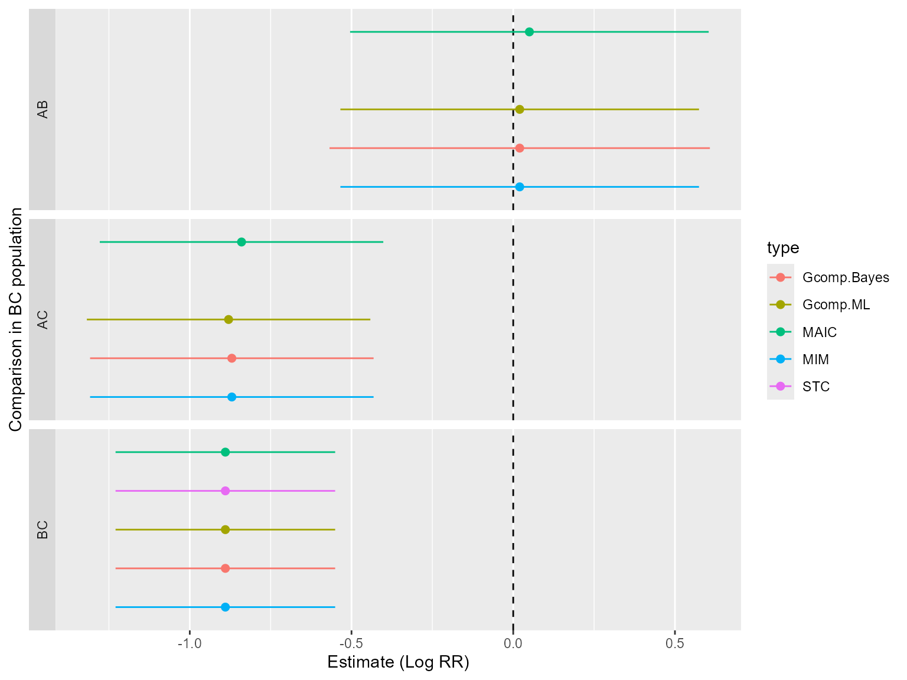

# Count data example

## Introduction

This is the vignette for performing population adjustment methods with
count data, in order to compare marginal treatment effects when there
are cross-trial differences in effect modifiers and limited
patient-level data. We will demonstrate how to apply MAIC, STC,
G-computation with ML, G-computation with Bayesian inference and
multiple imputation marginalisation. The document structure follow the
binary data example vignette which should be referred to for more
details.

## Example analysis

First, let us load necessary packages.

``` r
# install.packages("outstandR",
#  repos = c("https://statisticshealtheconomics.r-universe.dev", "https://cloud.r-project.org"))
#
# install.packages("simcovariates",
#  repos = c("https://n8thangreen.r-universe.dev", "https://cloud.r-project.org"))

library(boot)      # non-parametric bootstrap in MAIC and ML G-computation
library(copula)    # simulating BC covariates from Gaussian copula
library(rstanarm)  # fit outcome regression, draw outcomes in Bayesian G-computation
library(tidyr)
library(dplyr)
library(MASS)
library(outstandR)
library(simcovariates)
```

### Data

We first simulate both the IPD and ALD count data. See the binary data
example vignette for more details on how this is implemented. The
difference with that example is that we change the `family` argument in
[`gen_data()`](https://rdrr.io/pkg/simcovariates/man/gen_data.html) to
`poisson(link = "log")`, corresponding to the count data case. The
[`gen_data()`](https://rdrr.io/pkg/simcovariates/man/gen_data.html)
function is available in the
[simcovariates](https://github.com/n8thangreen/simcovariates) package on
GitHub.

``` r

N <- 200
allocation <- 2/3      # active treatment vs. placebo allocation ratio (2:1)
b_trt <- log(0.17)     # conditional effect of active treatment vs. common comparator
b_X <- -log(0.5)       # conditional effect of each prognostic variable
b_EM <- -log(0.67)     # conditional interaction effect of each effect modifier
meanX_AC <- c(0.45, 0.45)       # mean of normally-distributed covariate in AC trial
meanX_BC <- c(0.6, 0.6)         # mean of each normally-distributed covariate in BC
meanX_EM_AC <- c(0.45, 0.45)    # mean of normally-distributed EM covariate in AC trial
meanX_EM_BC <- c(0.6, 0.6)      # mean of each normally-distributed EM covariate in BC
sdX <- c(0.4, 0.4)     # standard deviation of each covariate (same for AC and BC)
sdX_EM <- c(0.4, 0.4)  # standard deviation of each EM covariate
corX <- 0.2            # covariate correlation coefficient  
b_0 <- -0.6            # baseline intercept coefficient  ##TODO: fixed value

covariate_defns_ipd <- list(
  PF_cont_1 = list(type = continuous(mean = meanX_AC[1], sd = sdX[1]),
                    role = "prognostic"),
  PF_cont_2 = list(type = continuous(mean = meanX_AC[2], sd = sdX[2]),
                    role = "prognostic"),
  EM_cont_1 = list(type = continuous(mean = meanX_EM_AC[1], sd = sdX_EM[1]),
                    role = "effect_modifier"),
  EM_cont_2 = list(type = continuous(mean = meanX_EM_AC[2], sd = sdX_EM[2]),
                    role = "effect_modifier")
)

b_prognostic <- c(PF_cont_1 = b_X, PF_cont_2 = b_X)

b_effect_modifier <- c(EM_cont_1 = b_EM, EM_cont_2 = b_EM)

num_normal_covs <- length(covariate_defns_ipd)
cor_matrix <- matrix(corX, num_normal_covs, num_normal_covs)
diag(cor_matrix) <- 1

rownames(cor_matrix) <- c("PF_cont_1", "PF_cont_2", "EM_cont_1", "EM_cont_2")
colnames(cor_matrix) <- c("PF_cont_1", "PF_cont_2", "EM_cont_1", "EM_cont_2")

ipd_trial <- simcovariates::gen_data(
  N = N,
  b_0 = b_0,
  b_trt = b_trt,
  covariate_defns = covariate_defns_ipd,
  b_prognostic = b_prognostic,
  b_effect_modifier = b_effect_modifier,
  cor_matrix = cor_matrix,
  trt_assignment = list(prob_trt1 = allocation),
  family = poisson("log"))

ipd_trial$trt <- factor(ipd_trial$trt, labels = c("C", "A"))
```

Similarly, for the aggregate data but with the additional summarise step
(see binary data example vignette for code).

This general format of the data sets are in a ‘long’ style consisting of
the following.

#### `ipd_trial`: Individual patient data

- `PF_*`: Patient measurements prognostic factors
- `EM_*`: Patient measurements effect modifiers
- `trt`: Treatment label (factor)
- `y`: Counts

#### `ald_trial`: Aggregate-level data

- `variable`: Covariate name. In the case of treatment arm sample size
  this is `NA`
- `statistic`: Summary statistic name from mean, standard deviation or
  sum
- `value`: Numerical value of summary statistic
- `trt`: Treatment label. Because we assume a common covariate
  distribution between treatment arms this is `NA`

Our data look like the following.

``` r
head(ipd_trial)
#>   id   PF_cont_1   PF_cont_2  EM_cont_1   EM_cont_2 trt y     true_eta
#> 1  1  0.75056436  0.95597583  0.3158969  1.19430733   C 4  0.582883524
#> 2  2  0.83246940  0.11789773  0.5094678  0.08180243   A 1 -1.476422106
#> 3  3  1.13401333  1.15036919  1.2342379  0.74771694   A 3  0.005184912
#> 4  4  0.78518298  0.83080451 -0.1625820  0.35223227   C 1  0.520117172
#> 5  5 -0.38547667  0.87070020  0.7213797 -0.03557032   A 1 -1.760974264
#> 6  6 -0.04851591 -0.03013213  0.6580067  0.05853054   A 0 -2.139514435
```

There are 4 correlated continuous covariates generated per subject,
simulated from a multivariate normal distribution. Treatment `trt` takes
either new treatment *A* or standard of care / status quo *C*. The ITC
is ‘anchored’ via *C*, the common treatment.

``` r
ald_trial
#> # A tibble: 16 × 4
#>    variable  statistic   value trt  
#>    <chr>     <chr>       <dbl> <chr>
#>  1 EM_cont_1 mean        0.616 NA   
#>  2 EM_cont_1 sd          0.408 NA   
#>  3 EM_cont_2 mean        0.635 NA   
#>  4 EM_cont_2 sd          0.354 NA   
#>  5 PF_cont_1 mean        0.666 NA   
#>  6 PF_cont_1 sd          0.398 NA   
#>  7 PF_cont_2 mean        0.663 NA   
#>  8 PF_cont_2 sd          0.404 NA   
#>  9 y         mean        1.07  C    
#> 10 y         sd          1.01  C    
#> 11 y         sum        77     C    
#> 12 y         mean        0.438 B    
#> 13 y         sd          0.750 B    
#> 14 y         sum        56     B    
#> 15 NA        N          72     C    
#> 16 NA        N         128     B
```

In this case, we have 4 covariate mean and standard deviation values;
and the total, average and sample size for each treatment *B* and *C*.

In the following we will implement for MAIC, STC, and G-computation
methods to obtain the *marginal variance* and the *marginal treatment
effect*.

## Model fitting in R

The [outstandR](https://StatisticsHealthEconomics.github.io/outstandR)
package has been written to be easy to use and essential consists of a
single function,
[`outstandR()`](https://StatisticsHealthEconomics.github.io/outstandR/reference/outstandR.md).
This can be used to run all of the different types of model, which we
will call *strategies*. The first two arguments of
[`outstandR()`](https://StatisticsHealthEconomics.github.io/outstandR/reference/outstandR.md)
are the individual and aggregate-level data, respectively.

A `strategy` argument of `outstandR` takes functions called
`strategy_*()`, where the wildcard `*` is replaced by the name of the
particular method required,
e.g. [`strategy_maic()`](https://StatisticsHealthEconomics.github.io/outstandR/reference/strategy.md)
for MAIC. Each specific example is provided below.

The formula used in this model, passed as an argument to the strategy
function is

``` r
lin_form <- as.formula("y ~ PF_cont_1 + PF_cont_2 + trt:EM_cont_1 + trt:EM_cont_2")
```

### MAIC

As mentioned above, pass the model specific strategy function to the
main
[`outstandR()`](https://StatisticsHealthEconomics.github.io/outstandR/reference/outstandR.md)
function, in this case use
[`strategy_maic()`](https://StatisticsHealthEconomics.github.io/outstandR/reference/strategy.md).

``` r
outstandR_maic <-
  outstandR(ipd_trial, ald_trial,
            strategy = strategy_maic(
              formula = lin_form,
              family = poisson(link = "log")))
#> log rate used
#> 
#> log rate used
```

The returned object is of class `outstandR`.

``` r
outstandR_maic
#> Object of class 'outstandR' 
#> Model: poisson 
#> Scale: log_relative_risk 
#> Common treatment: C 
#> Individual patient data study: AC 
#> Aggregate level data study: BC 
#> Confidence interval level: 0.95 
#> 
#> Contrasts:
#> 
#> # A tibble: 3 × 5
#>   Treatments Estimate Std.Error lower.0.95 upper.0.95
#>   <chr>         <dbl>     <dbl>      <dbl>      <dbl>
#> 1 AB           0.0524    0.0801     -0.502      0.607
#> 2 AC          -0.841     0.0493     -1.28      -0.406
#> 3 BC          -0.894     0.0308     -1.24      -0.550
#> 
#> Absolute:
#> 
#> # A tibble: 2 × 5
#>   Treatments Estimate Std.Error lower.0.95 upper.0.95
#>   <chr>         <dbl>     <dbl> <lgl>      <lgl>     
#> 1 A             0.500   0.00577 NA         NA        
#> 2 C             1.16    0.0292  NA         NA
```

### Simulated Treatment Comparison (STC)

STC is the conventional outcome regression method. It involves fitting a
regression model of outcome on treatment and covariates to the IPD.
Simply pass the same as formula as before with the
[`strategy_stc()`](https://StatisticsHealthEconomics.github.io/outstandR/reference/strategy.md)
strategy function.

``` r
outstandR_stc <-
  outstandR(ipd_trial, ald_trial,
            strategy = strategy_stc(
              formula = lin_form,
              family = poisson(link = "log")))
#> log rate used
#> 
#> log rate used
outstandR_stc
#> Object of class 'outstandR' 
#> Model: poisson 
#> Scale: log_relative_risk 
#> Common treatment: C 
#> Individual patient data study: AC 
#> Aggregate level data study: BC 
#> Confidence interval level: 0.95 
#> 
#> Contrasts:
#> 
#> # A tibble: 3 × 5
#>   Treatments Estimate Std.Error lower.0.95 upper.0.95
#>   <chr>         <dbl>     <dbl>      <dbl>      <dbl>
#> 1 AB          NaN       NA           NA        NA    
#> 2 AC          NaN       NA           NA        NA    
#> 3 BC           -0.894    0.0308      -1.24     -0.550
#> 
#> Absolute:
#> 
#> # A tibble: 2 × 5
#>   Treatments Estimate Std.Error lower.0.95 upper.0.95
#>   <chr>         <dbl>     <dbl> <lgl>      <lgl>     
#> 1 A           NaN            NA NA         NA        
#> 2 C             0.330        NA NA         NA
```

### Parametric G-computation with maximum-likelihood estimation

G-computation marginalizes the conditional estimates by separating the
regression modelling from the estimation of the marginal treatment
effect for *A* versus *C*. Pass the
[`strategy_gcomp_ml()`](https://StatisticsHealthEconomics.github.io/outstandR/reference/strategy.md)
strategy function.

``` r
outstandR_gcomp_ml <-
  outstandR(ipd_trial, ald_trial,
            strategy = strategy_gcomp_ml(
              formula = lin_form,
              family = poisson(link = "log")))
outstandR_gcomp_ml
#> Object of class 'outstandR' 
#> Model: poisson 
#> Scale: log_relative_risk 
#> Common treatment: C 
#> Individual patient data study: AC 
#> Aggregate level data study: BC 
#> Confidence interval level: 0.95 
#> 
#> Contrasts:
#> 
#> # A tibble: 3 × 5
#>   Treatments Estimate Std.Error lower.0.95 upper.0.95
#>   <chr>         <dbl>     <dbl>      <dbl>      <dbl>
#> 1 AB           0.0169    0.0798     -0.537      0.571
#> 2 AC          -0.877     0.0490     -1.31      -0.443
#> 3 BC          -0.894     0.0308     -1.24      -0.550
#> 
#> Absolute:
#> 
#> # A tibble: 2 × 5
#>   Treatments Estimate Std.Error lower.0.95 upper.0.95
#>   <chr>         <dbl>     <dbl> <lgl>      <lgl>     
#> 1 A             0.621   0.00936 NA         NA        
#> 2 C             1.50    0.0717  NA         NA
```

### Bayesian G-computation with MCMC

The difference between Bayesian G-computation and its maximum-likelihood
counterpart is in the estimated distribution of the predicted outcomes.
The Bayesian approach also marginalizes, integrates or standardizes over
the joint posterior distribution of the conditional nuisance parameters
of the outcome regression, as well as the joint covariate distribution.

Pass the
[`strategy_gcomp_bayes()`](https://StatisticsHealthEconomics.github.io/outstandR/reference/strategy.md)
strategy function.

``` r
outstandR_gcomp_bayes <-
  outstandR(ipd_trial, ald_trial,
            strategy = strategy_gcomp_bayes(
              formula = lin_form,
              family = poisson(link = "log")))
```

``` r
outstandR_gcomp_bayes
#> Object of class 'outstandR' 
#> Model: poisson 
#> Scale: log_relative_risk 
#> Common treatment: C 
#> Individual patient data study: AC 
#> Aggregate level data study: BC 
#> Confidence interval level: 0.95 
#> 
#> Contrasts:
#> 
#> # A tibble: 3 × 5
#>   Treatments Estimate Std.Error lower.0.95 upper.0.95
#>   <chr>         <dbl>     <dbl>      <dbl>      <dbl>
#> 1 AB           0.0233    0.0851     -0.548      0.595
#> 2 AC          -0.871     0.0543     -1.33      -0.414
#> 3 BC          -0.894     0.0308     -1.24      -0.550
#> 
#> Absolute:
#> 
#> # A tibble: 2 × 5
#>   Treatments Estimate Std.Error lower.0.95 upper.0.95
#>   <chr>         <dbl>     <dbl> <lgl>      <lgl>     
#> 1 A             0.616    0.0102 NA         NA        
#> 2 C             1.48     0.0678 NA         NA
```

### Multiple imputation marginalisation

Finally, the strategy function to pass to
[`outstandR()`](https://StatisticsHealthEconomics.github.io/outstandR/reference/outstandR.md)
for multiple imputation marginalisation is
[`strategy_mim()`](https://StatisticsHealthEconomics.github.io/outstandR/reference/strategy.md),

``` r
outstandR_mim <-
  outstandR(ipd_trial, ald_trial,
            strategy = strategy_mim(
              formula = lin_form,
              family = poisson(link = "log")))
```

    #> log rate used
    #> 
    #> log rate used

``` r
outstandR_mim
#> Object of class 'outstandR' 
#> Model: poisson 
#> Scale: log_relative_risk 
#> Common treatment: C 
#> Individual patient data study: AC 
#> Aggregate level data study: BC 
#> Confidence interval level: 0.95 
#> 
#> Contrasts:
#> 
#> # A tibble: 3 × 5
#>   Treatments Estimate Std.Error lower.0.95 upper.0.95
#>   <chr>         <dbl>     <dbl>      <dbl>      <dbl>
#> 1 AB           0.0237    0.0825     -0.539      0.587
#> 2 AC          -0.870     0.0517     -1.32      -0.425
#> 3 BC          -0.894     0.0308     -1.24      -0.550
#> 
#> Absolute:
#> 
#> # A tibble: 2 × 5
#>   Treatments Estimate Std.Error lower.0.95 upper.0.95
#>   <chr>      <lgl>    <lgl>     <lgl>      <lgl>     
#> 1 A          NA       NA        NA         NA        
#> 2 C          NA       NA        NA         NA
```

### Model comparison

Combine all outputs for relative effects table of all contrasts and
methods.

|     |  MAIC |   STC | Gcomp.ML | Gcomp.Bayes |   MIM |
|:----|------:|------:|---------:|------------:|------:|
| AB  |  0.05 |   NaN |     0.02 |        0.02 |  0.02 |
| AC  | -0.84 |   NaN |    -0.88 |       -0.87 | -0.87 |
| BC  | -0.89 | -0.89 |    -0.89 |       -0.89 | -0.89 |


