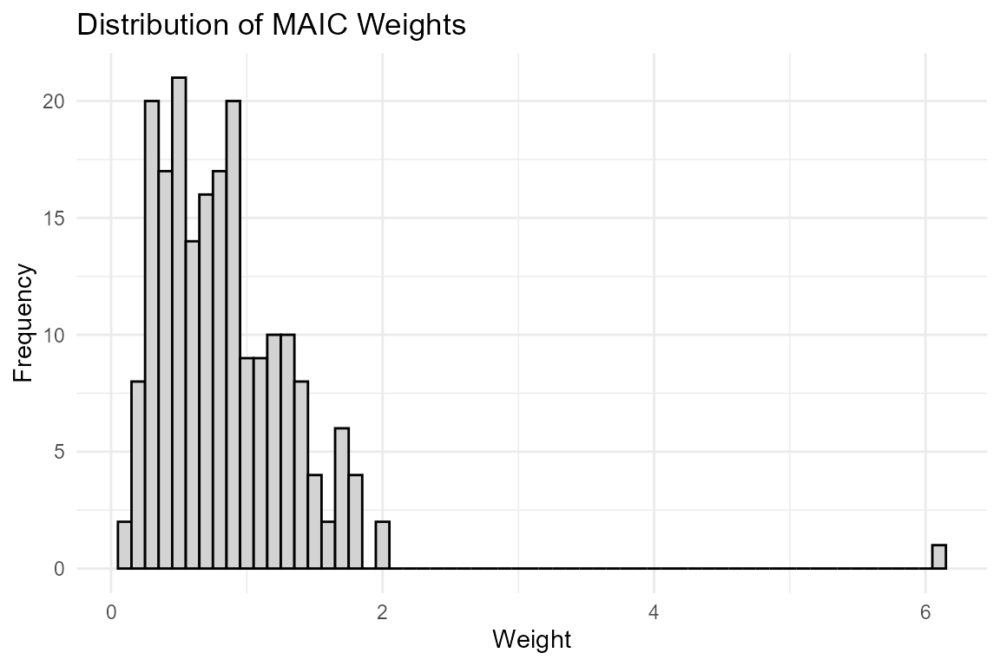
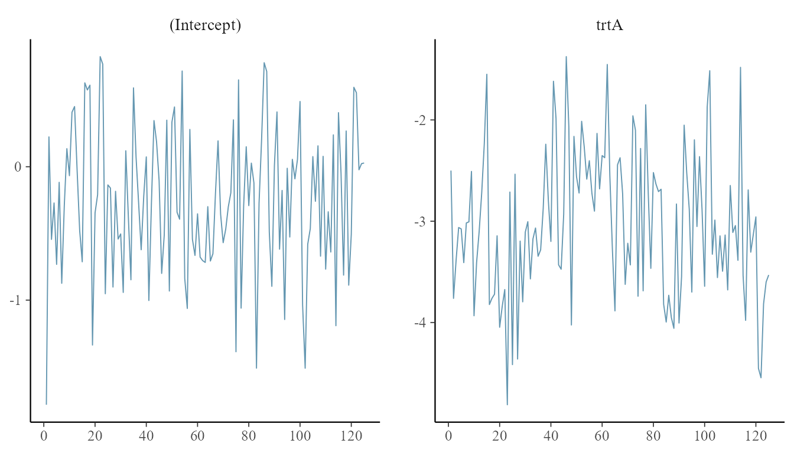

<div id="main" class="col-md-9" role="main">

# Advanced Features: Diagnostics and Uncertainty Quantification

<div class="section level2">

## Introduction

This vignette demonstrates how to access model diagnostics, check weight
distributions, and perform robust variance estimation using the objects
returned by `outstandR`.

First, let’s load the packages and prepare the data and models that we
will use throughout the examples.

<div id="cb1" class="sourceCode">

``` r
library(outstandR)
library(ggplot2)

data(AC_IPD_binY_contX) # A vs C IPD
data(BC_ALD_binY_contX) # B vs C ALD

# Formulas
lin_form_contX <- as.formula("y ~ PF_cont_1 + PF_cont_2 + trt + trt:EM_cont_1 + trt:EM_cont_2")
bal_form_contX <- as.formula("~ EM_cont_1 + EM_cont_2")
```

</div>

------------------------------------------------------------------------

</div>

<div class="section level2">

## 1. Robust Variance Estimation

Standard errors in population-adjusted analyses can be sensitive to
model misspecification. `outstandR` supports robust (sandwich) standard
errors for MAIC and ML-based G-computation.

Variance is approximated using the delta method:

$$\\widehat{Var}\\left( \\widehat{\\Delta} \\right) = \\nabla g\\left( \\widehat{\\theta} \\right)^{\\top} \\cdot V\_{sand} \\cdot \\nabla g\\left( \\widehat{\\theta} \\right)$$

To use this, set `var_method = "sandwich"` in your `outstandR()` call:

<div id="cb2" class="sourceCode">

``` r
stc_robust <- outstandR(
  ipd_trial = AC_IPD_binY_contX,
  ald_trial = BC_ALD_binY_contX,
  strategy = strategy_gcomp_ml(
    formula = list(outcome_model = lin_form_contX),
    family = binomial()),
  seed = 12345,
  var_method = "sandwich"
)

print(stc_robust)
#> Object of class 'outstandR' 
#> ITC algorithm: GCOMP_ML 
#> Model: binomial 
#> Scale: log_odds 
#> Common treatment: C 
#> Individual patient data study: A vs C 
#> Aggregate level data study: B vs C 
#> Confidence interval level: 0.95 
#> 
#> Contrasts:
#> 
#> # A tibble: 3 × 5
#>   Treatments Estimate Std.Error lower.0.95 upper.0.95
#>   <chr>         <dbl>     <dbl>      <dbl>      <dbl>
#> 1 AB            0.748     0.228     -0.187    1.68   
#> 2 AC           -0.696     0.126     -1.39    -0.00128
#> 3 BC           -1.44      0.102     -2.07    -0.817  
#> 
#> Absolute:
#> 
#> # A tibble: 3 × 5
#>   Treatments Estimate Std.Error lower.0.95 upper.0.95
#>   <chr>         <dbl>     <dbl>      <dbl>      <dbl>
#> 1 A             0.293   0.00285      0.188      0.398
#> 2 B            -0.993   0.107       -1.63      -0.351
#> 3 C             0.451   0.00489      0.314      0.588
```

</div>

------------------------------------------------------------------------

</div>

<div class="section level2">

## 2. Model Diagnostics

`outstandR` returns detailed model artifacts to facilitate diagnostics.

<div class="section level3">

### MAIC Weight Diagnostics

For MAIC, you can extract the calculated weights to check for extreme
outliers and view the Effective Sample Size (ESS). First, we run the
MAIC model:

<div id="cb3" class="sourceCode">

``` r
outstandR_maic <- outstandR(
  ipd_trial = AC_IPD_binY_contX,
  ald_trial = BC_ALD_binY_contX,
  strategy = strategy_maic(
    formula = list(outcome_model = formula("y ~ trt"),
                   balance_model = bal_form_contX),
    family = binomial(link = "logit")),
  seed = 12345
)
```

</div>

We can inspect the Effective Sample Size (ESS) to assess if we have
suffered a severe loss of power due to matching:

<div id="cb4" class="sourceCode">

``` r
# Check Effective Sample Size
print(outstandR_maic$model$ESS)
#>      ESS 
#> 136.8594
```

</div>

Next, we can plot a histogram of the weights to check for extreme or
dominant weights:

<div id="cb5" class="sourceCode">

``` r
# Plot a histogram of weights
ggplot(data.frame(weights = outstandR_maic$model$weights), aes(x = weights)) +
  geom_histogram(binwidth = 0.1, color = "black", fill = "lightgray") +
  theme_minimal() +
  labs(title = "Distribution of MAIC Weights", x = "Weight", y = "Frequency")
```

</div>



</div>

<div class="section level3">

### Bayesian MCMC Diagnostics

For Bayesian G-computation and MIM, the underlying `stanfit` object is
retained in the output. First, let’s fit the Bayesian G-computation
strategy:

<div id="cb6" class="sourceCode">

``` r
outstandR_gcomp_bayes <- outstandR(
  ipd_trial = AC_IPD_binY_contX,
  ald_trial = BC_ALD_binY_contX,
  strategy = strategy_gcomp_bayes(
    formula = list(outcome_model = lin_form_contX),
    family = binomial(link = "logit")),
  seed = 12345,
  iter = 250,
  chains = 1,
  refresh = 0
)
```

</div>

We can extract the fit and pass it to packages like `bayesplot` (if
installed) or use `rstanarm`’s built-in plotting to assess MCMC
convergence:

<div id="cb7" class="sourceCode">

``` r
library(bayesplot)
stan_obj <- outstandR_gcomp_bayes$model$fit
mcmc_trace(stan_obj, pars = c("(Intercept)", "trtA"))
```

</div>



If `bayesplot` is not available, standard convergence diagnostics such
as `summary()` are available:

<div id="cb8" class="sourceCode">

``` r
summary(outstandR_gcomp_bayes$model$fit, pars = c("(Intercept)", "trtA"))
#> 
#> Model Info:
#>  function:     stan_glm
#>  family:       binomial [logit]
#>  formula:      y ~ PF_cont_1 + PF_cont_2 + trt + trt:EM_cont_1 + trt:EM_cont_2
#>  algorithm:    sampling
#>  sample:       125 (posterior sample size)
#>  priors:       see help('prior_summary')
#>  observations: 200
#>  predictors:   8
#> 
#> Estimates:
#>               mean   sd   10%   50%   90%
#> (Intercept) -0.3    0.6 -0.9  -0.3   0.5 
#> trtA        -3.0    0.7 -3.9  -3.1  -2.1 
#> 
#> MCMC diagnostics
#>             mcse Rhat n_eff
#> (Intercept) 0.0  1.0  145  
#> trtA        0.1  1.0   38  
#> 
#> For each parameter, mcse is Monte Carlo standard error, n_eff is a crude measure of effective sample size, and Rhat is the potential scale reduction factor on split chains (at convergence Rhat=1).
```

</div>

</div>

</div>

</div>
