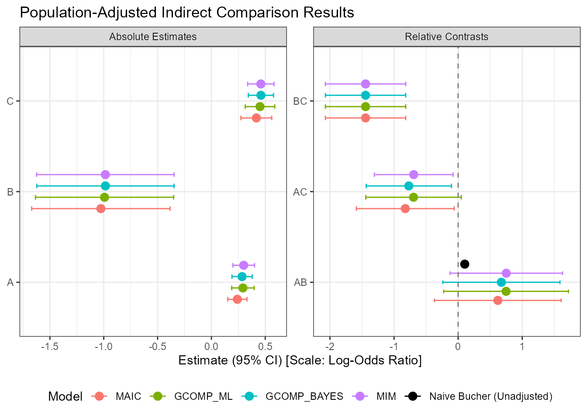

<div id="main" class="col-md-9" role="main">

# Getting Started with outstandR: A Practical Demonstration

<div class="section level2">

## Introduction

The `outstandR` package provides a unified framework for
Population-Adjusted Indirect Comparisons (PAIC). It supports
Matching-Adjusted Indirect Comparison (MAIC), G-computation via Maximum
Likelihood Estimation (ML) or Bayesian MCMC inference, and Multiple
Imputation Marginalization (MIM).

This vignette walks through a practical demonstration of how to load
data, specify strategies, run analyses, and compare the results across
different outcome types: **binary**, **continuous**, and **count**.

------------------------------------------------------------------------

</div>

<div class="section level2">

## 1. Binary Outcome Data

We load the synthetic binary outcome data and continuous covariates.

<div id="cb1" class="sourceCode">

``` r
library(outstandR)
data(AC_IPD_binY_contX) # A vs C IPD
data(BC_ALD_binY_contX) # B vs C ALD
```

</div>

For regression-based adjustments (G-computation and MIM), we define the
formula relating covariates, treatments, and the outcome. For
weight-based adjustments (MAIC), we specify a balancing formula of
covariates to match.

<div id="cb2" class="sourceCode">

``` r
# Outcome model formula (for G-computation and MIM)
lin_form_bin <- as.formula("y ~ PF_cont_1 + PF_cont_2 + trt + trt:EM_cont_1 + trt:EM_cont_2")

# Balancing model formula (for MAIC)
bal_form_bin <- as.formula("~ EM_cont_1 + EM_cont_2")
```

</div>

<div class="section level3">

### Running the Analysis

We can run all four strategy classes. For Bayesian methods, we specify
fewer iterations and a single chain for speed in this demonstration.

<div id="cb3" class="sourceCode">

``` r
# 1. Matching-Adjusted Indirect Comparison (MAIC)
outstandR_maic_bin <- outstandR(
  ipd_trial = AC_IPD_binY_contX,
  ald_trial = BC_ALD_binY_contX,
  strategy = strategy_maic(
    formula = list(outcome_model = formula("y ~ trt"),
                   balance_model = bal_form_bin),
    family = binomial(link = "logit")),
  seed = 12345
)

# 2. Maximum Likelihood G-computation (ML G-comp)
outstandR_gcomp_ml_bin <- outstandR(
  ipd_trial = AC_IPD_binY_contX,
  ald_trial = BC_ALD_binY_contX,
  strategy = strategy_gcomp_ml(
    formula = list(outcome_model = lin_form_bin),
    family = binomial(link = "logit")),
  seed = 12345
)

# 3. Bayesian G-computation
outstandR_gcomp_bayes_bin <- outstandR(
  ipd_trial = AC_IPD_binY_contX,
  ald_trial = BC_ALD_binY_contX,
  strategy = strategy_gcomp_bayes(
    formula = list(outcome_model = lin_form_bin),
    family = binomial(link = "logit")),
  seed = 12345,
  iter = 250,      # Small iterations for speed
  chains = 1,      # Single chain for demonstration
  refresh = 0
)

# 4. Multiple Imputation Marginalization (MIM)
outstandR_mim_bin <- outstandR(
  ipd_trial = AC_IPD_binY_contX,
  ald_trial = BC_ALD_binY_contX,
  strategy = strategy_mim(
    formula = list(outcome_model = lin_form_bin),
    family = binomial(link = "logit")),
  seed = 12345,
  iter = 250,
  chains = 1,
  refresh = 0
)
```

</div>

------------------------------------------------------------------------

</div>

</div>

<div class="section level2">

## 2. Continuous Outcome Data

For continuous data, we load the corresponding datasets and utilize the
`gaussian(link = "identity")` family.

<div id="cb4" class="sourceCode">

``` r
data(AC_IPD_contY_mixedX)
data(BC_ALD_contY_mixedX)

# Define models
lin_form_cont <- as.formula("y ~ X1 + X2 + X3 + trt + trt:(X1 + X2 + X4)")
bal_form_cont <- as.formula("~ X1 + X2 + X4")
```

</div>

<div class="section level3">

### Running the Analysis

We fit the strategies similarly, changing the outcome family to
`gaussian`.

<div id="cb5" class="sourceCode">

``` r
# 1. MAIC
outstandR_maic_cont <- outstandR(
  ipd_trial = AC_IPD_contY_mixedX,
  ald_trial = BC_ALD_contY_mixedX,
  strategy = strategy_maic(
    formula = list(outcome_model = formula("y ~ trt"),
                   balance_model = bal_form_cont),
    family = gaussian(link = "identity")),
  seed = 12345
)

# 2. ML G-comp
outstandR_gcomp_ml_cont <- outstandR(
  ipd_trial = AC_IPD_contY_mixedX,
  ald_trial = BC_ALD_contY_mixedX,
  strategy = strategy_gcomp_ml(
    formula = list(outcome_model = lin_form_cont),
    family = gaussian(link = "identity")),
  seed = 12345
)

# 3. Bayesian G-comp
outstandR_gcomp_bayes_cont <- outstandR(
  ipd_trial = AC_IPD_contY_mixedX,
  ald_trial = BC_ALD_contY_mixedX,
  strategy = strategy_gcomp_bayes(
    formula = list(outcome_model = lin_form_cont),
    family = gaussian(link = "identity")),
  seed = 12345,
  iter = 250,
  chains = 1,
  refresh = 0
)

# 4. MIM
outstandR_mim_cont <- outstandR(
  ipd_trial = AC_IPD_contY_mixedX,
  ald_trial = BC_ALD_contY_mixedX,
  strategy = strategy_mim(
    formula = list(outcome_model = lin_form_cont),
    family = gaussian(link = "identity")),
  seed = 12345,
  iter = 250,
  chains = 1,
  refresh = 0
)
```

</div>

------------------------------------------------------------------------

</div>

</div>

<div class="section level2">

## 3. Count Outcome Data

For count data, we use the `poisson(link = "log")` family with
Poisson-distributed outcomes.

<div id="cb6" class="sourceCode">

``` r
data(AC_IPD_countY_contX)
data(BC_ALD_countY_contX)

# Define models
lin_form_count <- as.formula("y ~ PF_cont_1 + PF_cont_2 + trt + trt:EM_cont_1 + trt:EM_cont_2")
bal_form_count <- as.formula("~ EM_cont_1 + EM_cont_2")
```

</div>

<div class="section level3">

### Running the Analysis

<div id="cb7" class="sourceCode">

``` r
# 1. MAIC
outstandR_maic_count <- outstandR(
  ipd_trial = AC_IPD_countY_contX,
  ald_trial = BC_ALD_countY_contX,
  strategy = strategy_maic(
    formula = list(outcome_model = formula("y ~ trt"),
                   balance_model = bal_form_count),
    family = poisson(link = "log")),
  seed = 12345
)

# 2. ML G-comp
outstandR_gcomp_ml_count <- outstandR(
  ipd_trial = AC_IPD_countY_contX,
  ald_trial = BC_ALD_countY_contX,
  strategy = strategy_gcomp_ml(
    formula = list(outcome_model = lin_form_count),
    family = poisson(link = "log")),
  seed = 12345
)

# 3. Bayesian G-comp
outstandR_gcomp_bayes_count <- outstandR(
  ipd_trial = AC_IPD_countY_contX,
  ald_trial = BC_ALD_countY_contX,
  strategy = strategy_gcomp_bayes(
    formula = list(outcome_model = lin_form_count),
    family = poisson(link = "log")),
  seed = 12345,
  iter = 250,
  chains = 1,
  refresh = 0
)

# 4. MIM
outstandR_mim_count <- outstandR(
  ipd_trial = AC_IPD_countY_contX,
  ald_trial = BC_ALD_countY_contX,
  strategy = strategy_mim(
    formula = list(outcome_model = lin_form_count),
    family = poisson(link = "log")),
  seed = 12345,
  iter = 250,
  chains = 1,
  refresh = 0
)
```

</div>

------------------------------------------------------------------------

</div>

</div>

<div class="section level2">

## 4. Comparing and Visualizing Results

We can display the structured `outstandR` results using standard print
methods or inspect individual estimates.

<div id="cb8" class="sourceCode">

``` r
print(outstandR_maic_bin)
#> Object of class 'outstandR' 
#> ITC algorithm: MAIC 
#> Model: binomial 
#> Scale: log_odds 
#> Common treatment: C 
#> Individual patient data study: A vs C 
#> Aggregate level data study: B vs C 
#> Confidence interval level: 0.95 
#> 
#> Contrasts:
#> 
#> # A tibble: 3 × 5
#>   Treatments Estimate Std.Error lower.0.95 upper.0.95
#>   <chr>         <dbl>     <dbl>      <dbl>      <dbl>
#> 1 AB            0.620     0.254     -0.368     1.61  
#> 2 AC           -0.824     0.152     -1.59     -0.0607
#> 3 BC           -1.44      0.102     -2.07     -0.817 
#> 
#> Absolute:
#> 
#> # A tibble: 3 × 5
#>   Treatments Estimate Std.Error lower.0.95 upper.0.95
#>   <chr>         <dbl>     <dbl>      <dbl>      <dbl>
#> 1 A             0.241   0.00208      0.151      0.330
#> 2 B            -1.03    0.108       -1.67      -0.384
#> 3 C             0.417   0.00534      0.274      0.561
```

</div>

The package provides a built-in `plot()` method to visualize contrasts
and absolute estimates side by side. By passing multiple fitted objects,
we can directly compare strategies:

<div id="cb9" class="sourceCode">

``` r
plot(outstandR_maic_bin, outstandR_gcomp_ml_bin, outstandR_gcomp_bayes_bin, outstandR_mim_bin)
```

</div>



------------------------------------------------------------------------

</div>

<div class="section level2">

## 5. Alternative Outcome Scales

By default, the package reports effects on the link function’s scale.
You can customize the scale of interest using the `scale` argument.

For instance, we can specify a Risk Difference instead of Log-Odds for
the binary outcome analysis:

<div id="cb10" class="sourceCode">

``` r
outstandR_maic_rd <- outstandR(
  ipd_trial = AC_IPD_binY_contX,
  ald_trial = BC_ALD_binY_contX,
  strategy = strategy_maic(
    formula = list(outcome_model = formula("y ~ trt"),
                   balance_model = bal_form_bin),
    family = binomial(link = "logit")),
  scale = "risk_difference",
  seed = 12345
)

print(outstandR_maic_rd)
#> Object of class 'outstandR' 
#> ITC algorithm: MAIC 
#> Model: binomial 
#> Scale: risk_difference 
#> Common treatment: C 
#> Individual patient data study: A vs C 
#> Aggregate level data study: B vs C 
#> Confidence interval level: 0.95 
#> 
#> Contrasts:
#> 
#> # A tibble: 3 × 5
#>   Treatments Estimate Std.Error lower.0.95 upper.0.95
#>   <chr>         <dbl>     <dbl>      <dbl>      <dbl>
#> 1 AB            0.165   0.443       -1.14      1.47  
#> 2 AC           -0.177   0.00704     -0.341    -0.0121
#> 3 BC           -0.341   0.436       -1.63      0.952 
#> 
#> Absolute:
#> 
#> # A tibble: 3 × 5
#>   Treatments Estimate Std.Error lower.0.95 upper.0.95
#>   <chr>         <dbl>     <dbl>      <dbl>      <dbl>
#> 1 A            0.241    0.00208      0.151      0.330
#> 2 B            0.0760   0.441       -1.23       1.38 
#> 3 C            0.417    0.00534      0.274      0.561
```

</div>

</div>

</div>
